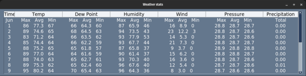
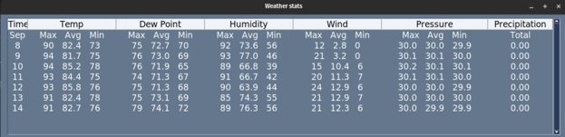
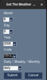
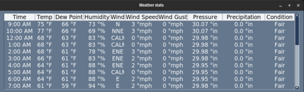

## A07
### Dylan Miles
### Description:
Web scrape a weather site and display results in SimplePythonGUI

### Files

|   #   | File            | Description                                        |
| :---: | --------------- | -------------------------------------------------- |
|   1   | [get_weather.py](./get_weather.py)         | Main driver of my project, run it to get the full experience.      |
|   2   | [gui.py](./gui.py)  | Just the prompt at the beginning, can be run standalone but won't do anything after submitting        |
|   3   | [table.py](./table.py) | another gui screen to show the weather results |
|   4   | [airports-better.json](./airports-better.json) | List of big airports and their information, required for gui.py |
|   5   | [requirements.txt](./requirements.txt) | List of python dependencies for this project |

### Instructions

Python 3, and the packages in [requirements.txt](./requirements.txt), are required

to run: `python -u "/home/bfce/4883-Software-Tools-Miles/Assignments/A07/get_weather.py"`

- Example I/O:

  input: (Leave prompts blank for defaults=current date, KLAW zone, monthly)

     

    output: 

    

    input: (weekly, random date/location)

     

    output: 

    

    
    input: (daily, random date/location)

     

    output: 

    
